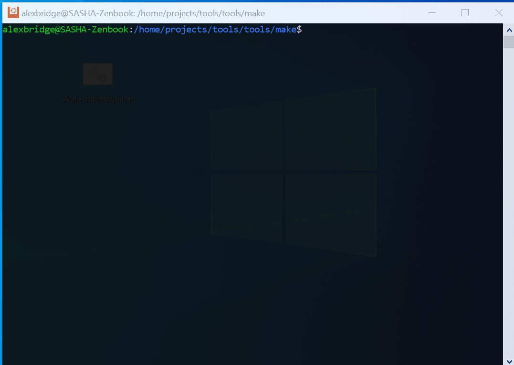

### Useful make recipes

Different make recipes for day to day development: git, docker, shell

#### Live example


#### Usage

- clone 
- copy Makefile to user directory, eg `$HOME/Makefile`
- create alias 
```
alias mmake='make --file=~/Makefile
```
- use `mmake`
    - by default all available recipes will be listed with fzf

